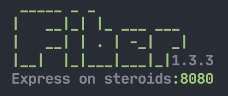

# 🚀  Application

## New

Method creates a new **Fiber** named instance.

```go
app := fiber.New()
```

## Static

Serve static files such as **images**, **CSS** and **JavaScript** files, you can use the **Static** method.


By default, this method will send `index.html` files in response to a request on a directory.


#### Signature

```go
app.Static(root string)         // => without prefix
app.Static(prefix, root string) // => with prefix
```

#### Examples

Use the following code to serve files in a directory named `./public`

```go
app.Static("./public")

// => http://localhost:3000/hello.html
// => http://localhost:3000/js/jquery.js
// => http://localhost:3000/css/style.css
```

To serve from multiple directories, you can use **Static** multiple times.

```go
// Serve files from "./public" directory:
app.Static("./public") 

// Serve files from "./files" directory:
app.Static("./files")
```


Use a reverse proxy cache like [NGINX](https://www.nginx.com/resources/wiki/start/topics/examples/reverseproxycachingexample/) to improve performance of serving static assets.


To create a virtual path prefix \(_where the path does not actually exist in the file system_\) for files that are served by the **Static** method, specify a prefix path for the static directory, as shown below:

```go
app.Static("/static", "./public")

// => http://localhost:3000/static/hello.html
// => http://localhost:3000/static/js/jquery.js
// => http://localhost:3000/static/css/style.css
```

## Methods

Routes an HTTP request, where **METHOD** is the [HTTP method](https://developer.mozilla.org/en-US/docs/Web/HTTP/Methods) of the request.

#### Signature

```go
app.METHOD(handler func(*Ctx))              // match any path
app.METHOD(path string, handler func(*Ctx)) // match specific path
```

#### Example

```go
// Single method
app.Connect(...)
app.Delete(...)
app.Get(...)
app.Head(...)
app.Options(...)
app.Patch(...)
app.Post(...)
app.Put(...)
app.Trace(...)

// Matches all methods & complete path
app.All(...)

// Matches all methods & URLs starting with a specified path
app.Use(...)
```

## Listen

Binds and listens for connections on the specified address. This can be a `int` for port or `string` for address.

#### Signature

```go
app.Listen(address interface{}, tls ...string)
```

#### Example

```go
app.Listen(8080)
app.Listen("8080")
app.Listen(":8080")
app.Listen("127.0.0.1:8080")
```

To enable **TLS/HTTPS** you can append your **cert** and **key** path.

```go
app.Listen(443, "server.crt", "server.key")
```

## Settings

### Engine

You can change the default **Fasthttp** [server settings](https://github.com/valyala/fasthttp/blob/master/server.go#L150) via the **Fiber** instance. These settings need to be set **before** [Listen](application.md#listen) method.


Only change these settings, if you know **what** your are doing.


```go
app.Engine.Concurrency = 256 * 1024
app.Engine.DisableKeepAlive = false
app.Engine.ReadBufferSize = 4096
app.Engine.WriteBufferSize = 4096
app.Engine.ReadTimeout = 0
app.Engine.WriteTimeout = 0
app.Engine.IdleTimeout = 0
app.Engine.MaxConnsPerIP = 0
app.Engine.MaxRequestsPerConn = 0
app.Engine.TCPKeepalive = false
app.Engine.TCPKeepalivePeriod = 0
app.Engine.MaxRequestBodySize = 4 * 1024 * 1024
app.Engine.ReduceMemoryUsage = false
app.Engine.GetOnly = false
app.Engine.DisableHeaderNamesNormalizing = false
app.Engine.SleepWhenConcurrencyLimitsExceeded = 0
app.Engine.NoDefaultContentType = false
app.Engine.KeepHijackedConns = false
```

### Prefork

The Prefork option enables use of the [**SO\_REUSEPORT**](https://lwn.net/Articles/542629/) socket option, which is available in newer versions of many operating systems, including **DragonFly BSD** and **Linux** \(kernel version **3.9** and later\). This will spawn multiple Go processes listening on the same port.

**NGINX** has a great article about [Socket Sharding](https://www.nginx.com/blog/socket-sharding-nginx-release-1-9-1/), these pictures are taken from the same article.


You can enable the Prefork feature by adding the `-prefork` flag:

```bash
./server -prefork
```

Or set the `Prefork` option to `true`:

```go
app.Prefork = true // Prefork enabled

app.Get("/", func(c *fiber.Ctx) {
  msg := fmt.Sprintf("Worker #%v", os.Getpid())
  c.Send(msg)
  // => Worker #16858
  // => Worker #16877
  // => Worker #16895
})
```

### Server

Fiber by default does not send a [Server header](https://developer.mozilla.org/en-US/docs/Web/HTTP/Headers/Server), but you can enable this by changing the server value.

```go
app.Server = "Windows 95" // => Server: Windows 95
```

### Banner

When you launch your Fiber application, console will print a banner containing package version and listening port. _This is enabled by default._



To disable it, set `Banner` to `false`:

```go
app.Banner = false // Hide banner
```

## Test

Testing your application is done with the **Test** method.


Method is mostly used for `_test.go` files and application debugging.


#### Signature

```go
app.Test(req *http.Request) (*http.Response, error)
```

#### Example

```go
// Create route with GET method for test:
app.Get("/", func(c *Ctx) {
  fmt.Println(c.BaseURL())              // => http://google.com
  fmt.Println(c.Get("X-Custom-Header")) // => hi
  
  c.Send("hello, World!")
})

// http.Request
req, _ := http.NewRequest("GET", "http://google.com", nil)
req.Header.Set("X-Custom-Header", "hi")

// http.Response
resp, _ := app.Test(req)

// Do something with results:
if resp.StatusCode == 200 {
  body, _ := ioutil.ReadAll(resp.Body)
  fmt.Println(string(body)) // => Hello, World!
}
```

