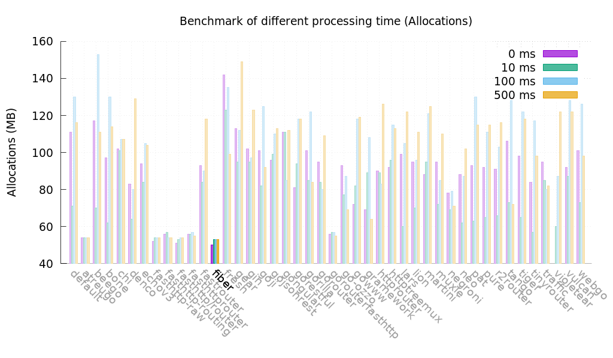

# Benchmarks

## TechEmpower

* **CPU** Intel Xeon Gold 5120
* **MEM** 32GB
* **GO** go1.13.6 linux/amd64
* **OS** Linux
* **NET** Dedicated Cisco 10-gigabit Ethernet switch.

Below you can see the results of tested go frameworks responding in plaintext.  
To view the list yourself, [Plaintext Go Results](https://www.techempower.com/benchmarks/#section=test&runid=350f0783-cc9b-4259-9831-28987799782a&hw=ph&test=plaintext&l=zijocf-1r).  
To see all language frameworks, [Plaintext All Results](https://www.techempower.com/benchmarks/#section=test&runid=350f0783-cc9b-4259-9831-28987799782a&hw=ph&test=plaintext).

Plaintext

Plaintext latency

JSON serialization

Single query

Multiple queries

Data updates

## Go-Web

[go-web-framework-benchmark](https://github.com/smallnest/go-web-framework-benchmark)

* **CPU** Intel\(R\) Xeon\(R\) Gold 6140 CPU @ 2.30GHz
* **MEM** 4GB
* **GO** go1.13.6 linux/amd64
* **OS** Linux

The first test case is to mock 0 ms, 10 ms, 100 ms, 500 ms processing time in handlers.

the concurrency clients are 5000.

Latency is the time of real processing time by web servers. The smaller is the better.

Allocs is the heap allocations by web servers when test is running. The unit is MB. The smaller is the better.

If we enable http pipelining, test result as below:

Concurrency test in 30 ms processing time, the test result for 100, 1000, 5000 clients is:

If we enable http pipelining, test result as below:

