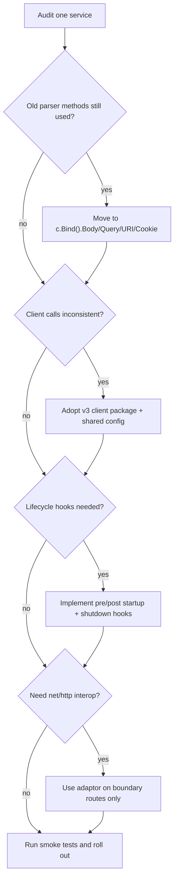

Most release posts answer one question: "What changed?"

Engineering teams usually need a different answer: **"What should we change first without creating rollout risk?"**

That is the angle of this guide. We'll focus on the Fiber v3 changes that have the highest impact in day-to-day backend work: input handling, HTTP client usage, startup/shutdown behavior, and interop.

<!-- truncate -->

## The Real Upgrade Mindset

Fiber v3 is not a cosmetic release. The framework keeps its speed and simplicity, but it encourages clearer boundaries: request parsing is centralized with `c.Bind()`, service-to-service calls move to the dedicated `client` package, lifecycle hooks are more explicit, and `net/http` interop is cleaner through the adaptor layer.

If you migrate these areas deliberately, most upgrade friction disappears.

## 1. Binding: Stop Scattering Parsing Logic

In older codebases, it's common to see different parser calls spread across handlers. In v3, this becomes much cleaner with `c.Bind()`.

```go
type CreateUserInput struct {
    Name  string `json:"name"`
    Email string `json:"email"`
}

app.Post("/users", func(c fiber.Ctx) error {
    var in CreateUserInput

    if err := c.Bind().Body(&in); err != nil {
        return c.Status(fiber.StatusBadRequest).JSON(fiber.Map{
            "error": err.Error(),
        })
    }

    return c.Status(fiber.StatusCreated).JSON(fiber.Map{"user": in})
})
```

The practical benefit is consistency. New team members can open any handler and immediately know where request data enters the system.

## 2. Client: Use the Rebuilt v3 Client Surface

v3 moves client behavior into `github.com/gofiber/fiber/v3/client` with better defaults and hooks.

```go
import "github.com/gofiber/fiber/v3/client"

func fetchHealth() error {
    cli := client.New().
        SetBaseURL("http://localhost:3000").
        SetTimeout(2 * time.Second)

    resp, err := cli.Get("/health")
    if err != nil {
        return err
    }

    if resp.StatusCode() != fiber.StatusOK {
        return fmt.Errorf("unexpected status: %d", resp.StatusCode())
    }

    return nil
}
```

This matters when services call other services frequently. A long-lived client with shared config is easier to reason about than ad-hoc per-request setup.

## 3. Hooks: Make Startup and Shutdown Predictable

If you run jobs, queues, or background workers, lifecycle ordering matters. v3 hooks make that explicit.

```go
app := fiber.New()

app.Hooks().OnPreStartupMessage(func(sm *fiber.PreStartupMessageData) error {
    sm.AddInfo("env", "Environment", "staging")
    return nil
})

app.Hooks().OnPreShutdown(func() error {
    log.Println("pre-shutdown: draining workers")
    return nil
})

app.Hooks().OnPostShutdown(func(err error) error {
    log.Printf("post-shutdown: err=%v", err)
    return nil
})

go func() {
    if err := app.Listen(":3000"); err != nil {
        log.Println(err)
    }
}()
```

In real systems, this gives you cleaner deploy behavior: fewer half-processed jobs and fewer "it works locally" shutdown bugs.

## 4. Custom Context: Add App-Specific Helpers Cleanly

`NewWithCustomCtx` is useful when cross-cutting helper logic appears in every handler.

```go
type AppCtx struct {
    fiber.DefaultCtx
}

func (c *AppCtx) TenantID() string {
    return c.Get("X-Tenant-ID", "public")
}

app := fiber.NewWithCustomCtx(func(app *fiber.App) fiber.CustomCtx {
    return &AppCtx{DefaultCtx: *fiber.NewDefaultCtx(app)}
})

app.Get("/tenant", func(c fiber.Ctx) error {
    return c.SendString(c.(*AppCtx).TenantID())
})
```

Use this sparingly, but when you need it, it keeps handlers focused.

## 5. Extractors and Adaptor: Interop Without Sprawl

Fiber v3's extractors and adaptor package are excellent for controlled integration.

```go
app.Use(keyauth.New(keyauth.Config{
    Extractor: extractors.Chain(
        extractors.FromAuthHeader("Bearer"),
        extractors.FromHeader("X-API-Key"),
    ),
}))

app.Get("/legacy", adaptor.HTTPHandlerFunc(func(w http.ResponseWriter, r *http.Request) {
    w.WriteHeader(http.StatusOK)
    _, _ = w.Write([]byte("legacy ok"))
}))
```

Treat adaptor as a bridge, not the end-state architecture. Keep core request paths native Fiber for maintainability and performance.

## Migration Flow You Can Actually Follow



## Run and Verify

Use your app's real entrypoint, then verify critical flows.

```bash
go mod tidy
go run ./cmd/api
```

```bash
curl -i http://localhost:3000/health
curl -i -X POST http://localhost:3000/users -H 'Content-Type: application/json' -d '{"name":"Ada","email":"ada@example.com"}'
curl -i http://localhost:3000/legacy
```

## Common Mistakes During v3 Upgrades

The biggest one is partial migration: one team moves to `Bind()`, another keeps old parser habits, and six weeks later debugging gets harder, not easier.

The second one is overusing adaptor. It is great for migration and integration, but not a replacement for proper Fiber-native handlers.

## Where to Practice These Changes

- CRUD + bind patterns: [gofiber/recipes/gorm-postgres](https://github.com/gofiber/recipes/tree/master/gorm-postgres)
- Static + middleware route behavior: [gofiber/recipes/file-server](https://github.com/gofiber/recipes/tree/master/file-server)
- SPA delivery fallback behavior: [gofiber/recipes/react-router](https://github.com/gofiber/recipes/tree/master/react-router)
- Swagger integration patterns: [gofiber/recipes/swagger](https://github.com/gofiber/recipes/tree/master/swagger)

If you upgrade only one service this week, pick the one with the highest request volume and implement this sequence there first. You will get clean feedback fastest.
