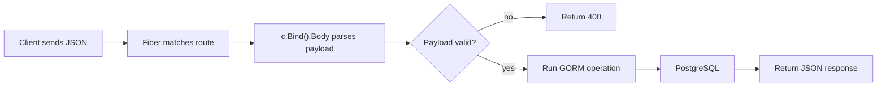

CRUD APIs are often where a backend project either becomes maintainable or becomes expensive.

At first, everything feels easy: a quick route, a quick DB call, done. Three months later, handlers parse requests in different ways, errors are inconsistent, and every change takes twice as long as expected.

This post is about avoiding that path from the start.

We'll use Fiber v3 with the `gorm-postgres` recipe, but the real goal is not just to "get CRUD working." The goal is to set up a structure your team can still understand when the API grows.

<!-- truncate -->

## What We Are Building

A simple books API with five operations:

- create a book
- list all books
- query by title
- update a book
- delete a book

Nothing here is technically complex. That is exactly why it is a good example: if the simple path is clean, the complex path gets easier later.

## Why Route Structure Matters More Than People Think

In early APIs, teams usually focus on handler internals and ignore route shape. Then versioning starts, clients depend on edge-case behavior, and cleanup gets painful.

The recipe keeps route registration explicit in one place:

```go
func setUpRoutes(app *fiber.App) {
    app.Get("/hello", routes.Hello)
    app.Get("/allbooks", routes.AllBooks)
    app.Post("/addbook", routes.AddBook)
    app.Post("/book", routes.Book)
    app.Put("/update", routes.Update)
    app.Delete("/delete", routes.Delete)
}
```

That explicit list gives you two advantages immediately:

1. onboarding gets faster because route intent is visible in one file
2. versioning is straightforward later (`/api/v1`, `/api/v2`) because your boundary is already clear

## Input Handling: Be Boring and Consistent

Fiber v3's `c.Bind()` is one of the biggest quality-of-life improvements for API handlers.

Instead of improvising request parsing per endpoint, use one clear pattern: parse first, validate, then run business logic.

```go
func AddBook(c fiber.Ctx) error {
    book := new(models.Book)

    if err := c.Bind().Body(book); err != nil {
        return c.Status(fiber.StatusBadRequest).JSON(err.Error())
    }

    database.DB.Db.Create(&book)
    return c.Status(fiber.StatusOK).JSON(book)
}
```

This may look trivial, but this kind of consistency is what keeps code reviews short and reliable.

## What Actually Happens in a CRUD Request



The key design choice is where errors are handled. Do not push parse/validation errors too deep. If they are request-shape errors, fail early and return stable responses.

## Run Locally

```bash
git clone https://github.com/gofiber/recipes.git
cd recipes/gorm-postgres
go run app.go
```

The recipe expects local Postgres defaults. If your environment differs, adjust DSN settings in `database/database.go`.

## Smoke Tests That Are Worth Running

```bash
# Create
curl -i -X POST http://localhost:3000/addbook \
  -H 'Content-Type: application/json' \
  -d '{"title":"Distributed Systems","author":"Tanenbaum"}'

# Read all
curl -i http://localhost:3000/allbooks

# Read by title
curl -i -X POST http://localhost:3000/book \
  -H 'Content-Type: application/json' \
  -d '{"title":"Distributed Systems"}'

# Update
curl -i -X PUT http://localhost:3000/update \
  -H 'Content-Type: application/json' \
  -d '{"title":"Distributed Systems","author":"A. Tanenbaum"}'

# Delete
curl -i -X DELETE http://localhost:3000/delete \
  -H 'Content-Type: application/json' \
  -d '{"title":"Distributed Systems"}'
```

These are not just "demo commands." They are a minimum regression checklist for any CRUD service before merging route changes.

## Practical Lessons Before You Ship This Pattern

The recipe updates and deletes by title. That is fine for learning, but in production you should usually move to immutable identifiers (numeric ID, UUID, ULID).

Also avoid sending raw database errors to clients. Stable API error contracts reduce frontend coupling and simplify incident handling.

Finally, if you add auth/validation middleware later, keep the same flow discipline: parse -> validate -> execute -> map response.

## Recipe and Next Step

- Primary reference: [gofiber/recipes/gorm-postgres](https://github.com/gofiber/recipes/tree/master/gorm-postgres)

A strong next step is to add validation and move routes under `/api/v1` with consistent response envelopes (`data`, `error`, `meta`). That gives you a cleaner base before feature count grows.
