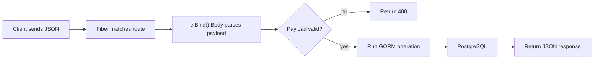

Every backend engineer has built CRUD endpoints. Most of us have also inherited CRUD APIs that became hard to maintain.

The difference is rarely the database. The difference is structure: where data enters, where validation fails, and how predictable handlers are.

This guide builds a clean baseline with Fiber v3 using the `gorm-postgres` recipe.

<!-- truncate -->

## What We Are Building

A small Books API with these endpoints:

- create a book
- list all books
- query by title
- update by title
- delete by title

Nothing fancy. The goal is clarity.

## Route Layout First, Business Logic Second

From the recipe (`app.go`), route registration stays very explicit.

```go
func setUpRoutes(app *fiber.App) {
    app.Get("/hello", routes.Hello)
    app.Get("/allbooks", routes.AllBooks)
    app.Post("/addbook", routes.AddBook)
    app.Post("/book", routes.Book)
    app.Put("/update", routes.Update)
    app.Delete("/delete", routes.Delete)
}
```

This is easy to scan today and easy to version later (`/api/v1/...`) when needed.

## Keep Input Handling Consistent With `c.Bind().Body`

In v3, avoid ad-hoc parsing and keep the request entrypoint obvious.

```go
func AddBook(c fiber.Ctx) error {
    book := new(models.Book)

    if err := c.Bind().Body(book); err != nil {
        return c.Status(fiber.StatusBadRequest).JSON(err.Error())
    }

    database.DB.Db.Create(&book)
    return c.Status(fiber.StatusOK).JSON(book)
}
```

One rule that scales well: **parse at the top of the handler, then branch into domain logic**.

## CRUD Data Flow (Request to DB to Response)



## Run Locally

```bash
git clone https://github.com/gofiber/recipes.git
cd recipes/gorm-postgres
go run app.go
```

Note: the recipe expects a local Postgres role/database setup. Adjust DSN in `database/database.go` if your local defaults differ.

## Smoke Test Every CRUD Path

```bash
# Create
curl -i -X POST http://localhost:3000/addbook \
  -H 'Content-Type: application/json' \
  -d '{"title":"Distributed Systems","author":"Tanenbaum"}'

# Read all
curl -i http://localhost:3000/allbooks

# Read by title
curl -i -X POST http://localhost:3000/book \
  -H 'Content-Type: application/json' \
  -d '{"title":"Distributed Systems"}'

# Update
curl -i -X PUT http://localhost:3000/update \
  -H 'Content-Type: application/json' \
  -d '{"title":"Distributed Systems","author":"A. Tanenbaum"}'

# Delete
curl -i -X DELETE http://localhost:3000/delete \
  -H 'Content-Type: application/json' \
  -d '{"title":"Distributed Systems"}'
```

## Practical Pitfalls (You Will Meet These)

The recipe updates and deletes by title, which is fine for learning but fragile in production. Real systems should usually update/delete by immutable IDs.

Also, do not return raw DB errors in production APIs. Map them to stable error responses early, before frontend teams start integrating.

## Recipe and Next Step

- Primary reference: [gofiber/recipes/gorm-postgres](https://github.com/gofiber/recipes/tree/master/gorm-postgres)

If you want to evolve this into production shape, the next step is adding request validation and moving routes under `/api/v1` with explicit response contracts.
