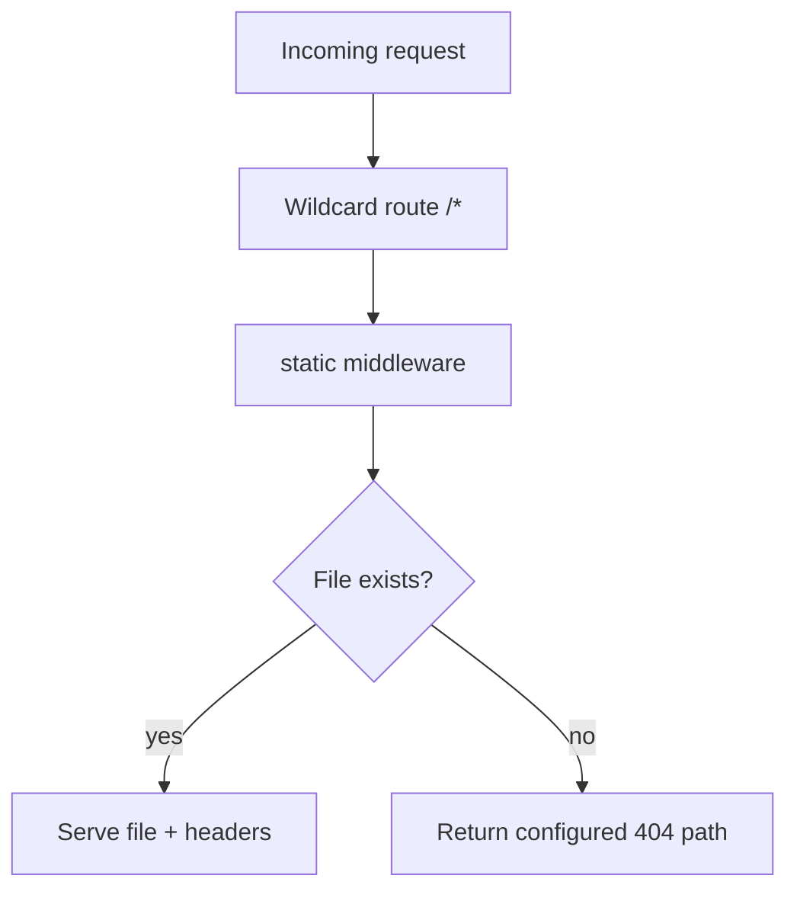

Serving files sounds easy until your frontend ships hashed bundles, browsers cache too aggressively, and missing assets create noisy support tickets.

Fiber v3 gives you explicit static middleware controls, which makes this predictable in production.

<!-- truncate -->

## The Baseline: A Minimal Static Server

From the recipe, the core setup is intentionally tiny.

```go
app := fiber.New()
app.Get("/*", static.New("./files"))
log.Fatal(app.Listen(":3000"))
```

That already solves basic asset hosting. Real projects usually need a bit more policy.

## Add Policy: Caching and Not-Found Behavior

```go
app.Get("/*", static.New("./files", static.Config{
    Browse:        false,
    MaxAge:        3600,
    CacheDuration: 10 * time.Second,
    NotFoundHandler: func(c fiber.Ctx) error {
        return c.Status(fiber.StatusNotFound).JSON(fiber.Map{
            "error": "asset not found",
            "path":  c.Path(),
        })
    },
}))
```

Two tips from production usage:

- keep `Browse` off in public deployments unless you explicitly need directory listing
- tune `MaxAge` differently for HTML vs versioned assets

## How Fiber Resolves Static Requests



## Run Locally

```bash
git clone https://github.com/gofiber/recipes.git
cd recipes/file-server
go run main.go
```

Then test a known file, a binary, and a missing path.

```bash
curl -i http://localhost:3000/hello.txt
curl -I http://localhost:3000/gopher.gif
curl -i http://localhost:3000/missing.txt
```

## What to Watch in Real Deployments

If API routes and static routes share one app, route order matters. Keep API endpoints explicit and avoid letting a broad wildcard absorb requests that were meant for API handlers.

Also remember that "works on localhost" static paths often fail in containers because the working directory changed. Prefer paths that are deterministic in your build/deploy layout.

## Recipe and Next Step

- Primary reference: [gofiber/recipes/file-server](https://github.com/gofiber/recipes/tree/master/file-server)

Next step: split cache strategy by file type and deploy immutable hashed assets with a longer cache horizon.
