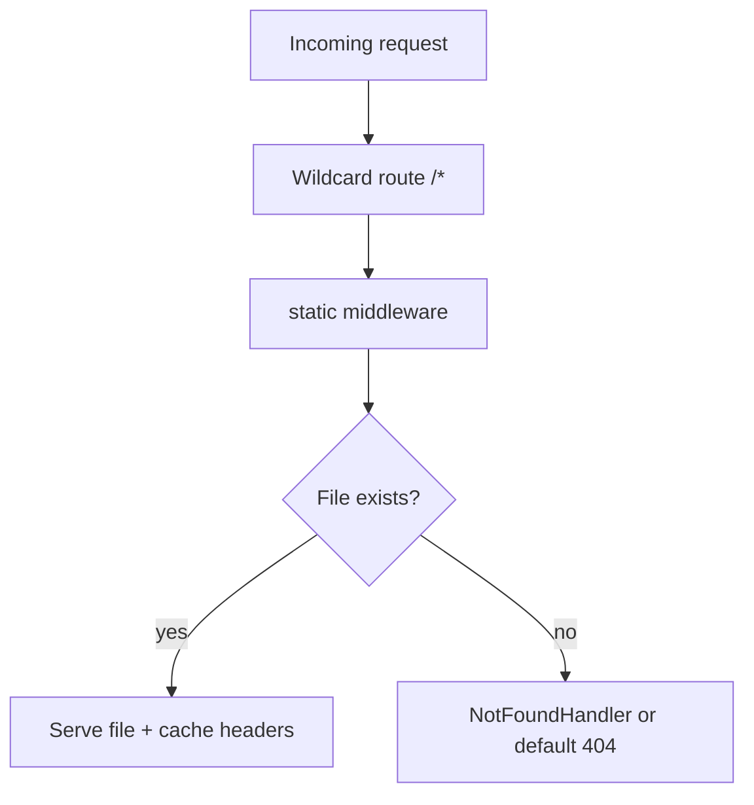

Static delivery is one of those topics that seems boring until it breaks.

A frontend deploy goes out, cache headers are wrong, the browser serves stale files, and suddenly support channels fill with "I still see the old UI" messages. Or worse: your container image uses a different working directory than local dev, and assets that worked locally return 404 in production.

Fiber v3 gives you a very capable static middleware surface. The trick is not only to use it, but to use it with clear policy.

<!-- truncate -->

## What Changed from v2

In v2, static file serving was a method on the app itself:

```go
// v2: app.Static was a built-in method
app.Static("/", "./public")
```

In v3, `app.Static()` has been removed. Static serving is now handled by the static middleware, which gives you more configuration options and a cleaner separation between routing and file serving:

```go
// v3: static middleware imported separately
import "github.com/gofiber/fiber/v3/middleware/static"

app.Get("/*", static.New("./public"))
```

The `Filesystem` middleware has also been removed — the static middleware now covers both use cases. If your v2 code used `app.Static()` or the filesystem middleware, update to the static middleware as part of your migration.

## Start Small, Then Add Rules Intentionally

The minimal setup from the recipe is short and useful:

```go
app := fiber.New()
app.Get("/*", static.New("./files"))
log.Fatal(app.Listen(":3000"))
```

This is enough for local demos and internal tooling. In production you usually need explicit decisions around browsing, cache duration, and missing-file behavior.

## A Production-Leaning Static Policy

```go
app.Get("/*", static.New("./files", static.Config{
    Browse:        false,
    MaxAge:        3600,
    CacheDuration: 10 * time.Second,
    NotFoundHandler: func(c fiber.Ctx) error {
        return c.Status(fiber.StatusNotFound).JSON(fiber.Map{
            "error": "asset not found",
            "path":  c.Path(),
        })
    },
}))
```

Why these settings matter:

- `Browse: false` avoids accidental directory listings that can expose internal file structure
- `MaxAge` defines client-side cache behavior via `Cache-Control` (start conservative and tune based on asset types)
- `CacheDuration` controls how long the middleware keeps file data in memory before re-reading from disk
- `NotFoundHandler` gives you predictable 404 responses instead of opaque defaults

## Serving from Embedded Filesystems

For single-binary deployments, Go's `embed.FS` is a practical choice. The static middleware supports any `fs.FS` implementation through the `FS` config field:

```go
//go:embed public/*
var embedFS embed.FS

sub, _ := fs.Sub(embedFS, "public")
app.Get("/*", static.New("", static.Config{
    FS: sub,
}))
```

The `fs.Sub` call strips the `public/` prefix from the embedded filesystem, so the middleware finds files at their expected paths. Without it, a request for `/index.html` would look for `public/index.html` inside the FS and fail.

This embeds your static assets directly into the compiled binary. No separate file copy step in your Dockerfile, no working directory confusion. The binary contains everything it needs.

You can also use `os.DirFS` when you need a sandboxed directory without the `embed` directive:

```go
app.Get("/files*", static.New("", static.Config{
    FS:     os.DirFS("files"),
    Browse: true,
}))
```

## Request Resolution, Visualized



The important architecture point: route order and route scope matter. If your app also exposes APIs, make sure static wildcard routes do not capture API paths unintentionally. Register API routes before the static wildcard, or scope the wildcard to a specific prefix:

```go
// API routes first
api := app.Group("/api")
api.Get("/users", listUsers)

// Static wildcard after API routes
app.Get("/*", static.New("./public"))
```

## Run Locally

```bash
git clone https://github.com/gofiber/recipes.git
cd recipes/file-server
go run main.go
```

Then verify one text file, one binary, and one missing path.

```bash
curl -i http://localhost:3000/hello.txt
curl -I http://localhost:3000/gopher.gif
curl -i http://localhost:3000/missing.txt
```

## Real-World Notes That Save Time Later

The most common static-serving bug is path confusion between local and deployed environments. Container working directories are often different from local shells, so be explicit about file roots in your image/runtime layout. Using `embed.FS` eliminates this class of bugs entirely.

The second most common bug is bad cache strategy. HTML shells and immutable hashed assets usually need different cache behavior. Treating them the same often creates either stale UI or unnecessary bandwidth usage. A practical split: no-cache or short `MaxAge` for HTML files, long `MaxAge` (1 year) for versioned JS/CSS with content hashes in filenames.

The third one is broad wildcards too early in the chain. Keep API routes explicit and test for route collisions before release. v3's stricter middleware prefix matching helps here — `/api` middleware no longer accidentally matches `/api-docs`.

## Recipe and Next Step

- Primary reference: [gofiber/recipes/file-server](https://github.com/gofiber/recipes/tree/master/file-server)
- Static middleware docs: [Static Middleware](/middleware/static)

A practical next step is to split cache policy by asset class: short cache for HTML, longer cache for versioned JS/CSS, and clear invalidation strategy during deploys.
