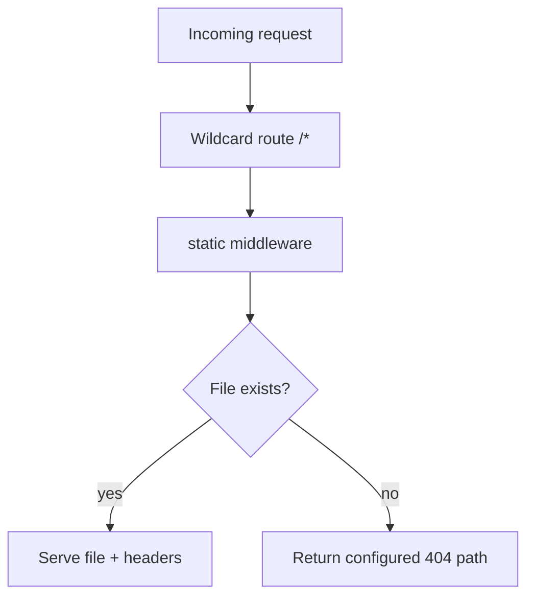

Static delivery is one of those topics that seems boring until it breaks.

A frontend deploy goes out, cache headers are wrong, the browser serves stale files, and suddenly support channels fill with "I still see the old UI" messages.

Fiber v3 gives you a very capable static middleware surface. The trick is not only to use it, but to use it with clear policy.

<!-- truncate -->

## Start Small, Then Add Rules Intentionally

The minimal setup from the recipe is short and useful:

```go
app := fiber.New()
app.Get("/*", static.New("./files"))
log.Fatal(app.Listen(":3000"))
```

This is enough for local demos and internal tooling. In production you usually need explicit decisions around browsing, cache duration, and missing-file behavior.

## A Production-leaning Static Policy

```go
app.Get("/*", static.New("./files", static.Config{
    Browse:        false,
    MaxAge:        3600,
    CacheDuration: 10 * time.Second,
    NotFoundHandler: func(c fiber.Ctx) error {
        return c.Status(fiber.StatusNotFound).JSON(fiber.Map{
            "error": "asset not found",
            "path":  c.Path(),
        })
    },
}))
```

Why these settings matter:

- `Browse: false` avoids accidental directory listings
- `MaxAge` defines client cache behavior (start conservative and tune)
- `NotFoundHandler` gives you predictable responses instead of opaque defaults

## Request Resolution, Visualized



The important architecture point: route order and route scope matter. If your app also exposes APIs, make sure static wildcard routes do not capture API paths unintentionally.

## Run Locally

```bash
git clone https://github.com/gofiber/recipes.git
cd recipes/file-server
go run main.go
```

Then verify one text file, one binary, and one missing path.

```bash
curl -i http://localhost:3000/hello.txt
curl -I http://localhost:3000/gopher.gif
curl -i http://localhost:3000/missing.txt
```

## Real-World Notes That Save Time Later

The most common static-serving bug is path confusion between local and deployed environments. Container working directories are often different from local shells, so be explicit about file roots in your image/runtime layout.

The second most common bug is bad cache strategy. HTML shells and immutable hashed assets usually need different cache behavior. Treating them the same often creates either stale UI or unnecessary bandwidth usage.

The third one is broad wildcards too early in the chain. Keep API routes explicit and test for route collisions before release.

## Recipe and Next Step

- Primary reference: [gofiber/recipes/file-server](https://github.com/gofiber/recipes/tree/master/file-server)

A practical next step is split cache policy by asset class: short cache for HTML, longer cache for versioned JS/CSS, and clear invalidation strategy during deploys.
