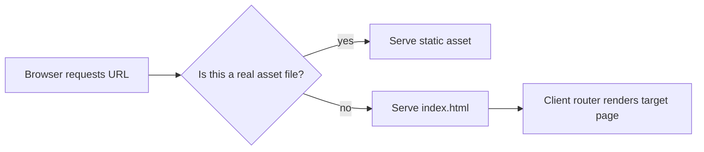

The most common SPA backend issue is not performance. It's routing.

Everything looks fine on `/`, then someone opens `/dashboard` directly or refreshes a deep link and gets a server-side `404`.

This guide fixes that pattern with Fiber v3.

<!-- truncate -->

## The Core Pattern

You need two behaviors at the same time:

1. serve real static files fast
2. return `index.html` for application routes that the client router owns

Recipe reference (`react-router`) does exactly that.

```go
app := fiber.New()

// Static assets
app.Get("/*", static.New("./web/build"))

// SPA fallback
app.Get("*", static.New("./web/build/index.html"))

log.Fatal(app.Listen(":8080"))
```

If you deploy under a subpath like `/web`, adjust both server routes and frontend router basename together.

## Request Resolution Model



## Run Locally

Use the recipe workflow (Docker is the most stable option for this project).

```bash
git clone https://github.com/gofiber/recipes.git
cd recipes/react-router

# Option A: Docker (recommended by recipe)
docker build . -t react-router:latest
docker run -d -p 8080:8080 react-router:latest

# Option B: Manual toolchain
cd web && yarn install && yarn build
cd ..
go run ./cmd/react-router/main.go
```

## Smoke Tests That Catch Real Routing Regressions

```bash
curl -i http://localhost:8080/
curl -i http://localhost:8080/react
curl -i http://localhost:8080/does-not-exist
```

Then do the browser test that matters most:

1. open a deep link directly (for example `/react`)
2. refresh the page
3. verify app still loads instead of server 404

## Where Teams Usually Slip

Many teams register the catch-all fallback too early and accidentally shadow static files or API routes.

Another common issue is forgetting frontend basename when serving under subpaths (`/web`, `/app`, etc.). Server and client must agree on the same base URL, or routing will look randomly broken.

## Recipe and Next Step

- Primary reference: [gofiber/recipes/react-router](https://github.com/gofiber/recipes/tree/master/react-router)
- Alternate reference: [gofiber/recipes/spa](https://github.com/gofiber/recipes/tree/master/spa)

Next step: separate cache policy for `index.html` (short) and hashed JS/CSS assets (long).
