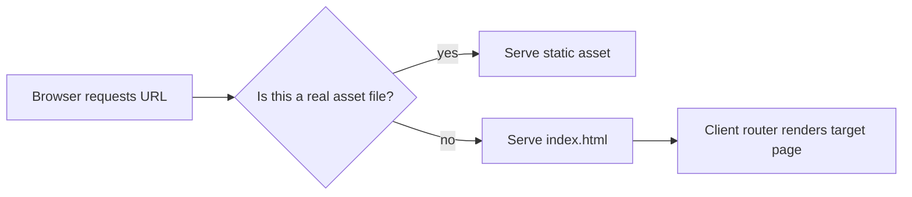

Most SPA delivery issues are not frontend bugs. They are server routing mismatches.

The homepage works, client-side navigation works, and then someone refreshes a deep link in production and gets a server-side `404`. It happens all the time because backend and frontend route ownership was never made explicit.

Fiber v3 makes this easy to solve once you set the pattern correctly.

<!-- truncate -->

## The Core Idea: Two Route Behaviors, One Service

Serving an SPA correctly means your backend must do two different things:

1. serve real static assets when the file exists
2. return `index.html` for app routes that the client router owns

The `react-router` recipe demonstrates this clearly.

```go
app := fiber.New()

// Static assets
app.Get("/*", static.New("./web/build"))

// SPA fallback
app.Get("*", static.New("./web/build/index.html"))

log.Fatal(app.Listen(":8080"))
```

If your app is mounted under a subpath (for example `/web`), server paths and frontend router basename must match.

## How Request Resolution Works



This is the mental model you want every team member to share. It prevents endless "is this a frontend issue or backend issue?" loops.

## Run Locally

Use the recipe workflow. Docker is usually the easiest path for consistent setup.

```bash
git clone https://github.com/gofiber/recipes.git
cd recipes/react-router

# Option A: Docker (recommended by recipe)
docker build . -t react-router:latest
docker run -d -p 8080:8080 react-router:latest

# Option B: Manual toolchain
cd web && yarn install && yarn build
cd ..
go run ./cmd/react-router/main.go
```

## Smoke Tests That Catch Real Breakage

```bash
curl -i http://localhost:8080/
curl -i http://localhost:8080/react
curl -i http://localhost:8080/does-not-exist
```

Then do the browser check that matters most:

1. open a deep route directly
2. refresh the page
3. confirm the app still loads instead of returning server `404`

## What Usually Breaks in Teams

The first issue is catch-all fallback placement. If it is too early, it can hide real static and API routes.

The second is basename mismatch. If frontend expects `/web` and backend serves from `/`, behavior will look random even though both sides "work" separately.

The third is cache confusion. If `index.html` is cached too aggressively, users can keep loading old route manifests after deploy.

## Recipe and Next Step

- Primary reference: [gofiber/recipes/react-router](https://github.com/gofiber/recipes/tree/master/react-router)
- Alternate reference: [gofiber/recipes/spa](https://github.com/gofiber/recipes/tree/master/spa)

A good next step is to make cache policy explicit per file type and document route ownership between backend and frontend in your service README.
