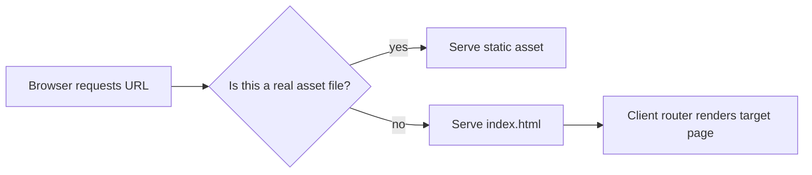

Most SPA delivery issues are not frontend bugs. They are server routing mismatches.

The homepage works, client-side navigation works, and then someone refreshes a deep link in production and gets a server-side `404`. It happens all the time because backend and frontend route ownership was never made explicit.

Fiber v3 makes this easy to solve once you set the pattern correctly.

<!-- truncate -->

## What Changed from v2

In v2, static file serving used the built-in `app.Static()` method:

```go
// v2: built-in static method
app.Static("/", "./web/build")
```

In v3, `app.Static()` is removed. You use the static middleware instead, which gives you more control over fallback behavior, caching, and 404 handling. The `Filesystem` middleware has also been removed — the static middleware covers both cases.

```go
// v3: static middleware
import "github.com/gofiber/fiber/v3/middleware/static"

app.Get("/*", static.New("./web/build"))
```

For SPA delivery, this change is actually an improvement because the middleware configuration gives you explicit control over how missing files are handled — which is exactly what SPA fallback routing needs.

## The Core Idea: Two Route Behaviors, One Service

Serving an SPA correctly means your backend must do two different things:

1. serve real static assets when the file exists (CSS, JS, images)
2. return `index.html` for app routes that the client router owns

The `react-router` recipe demonstrates this clearly:

```go
app := fiber.New()

// Static assets
app.Get("/*", static.New("./web/build"))

// SPA fallback — serves index.html for any route the static middleware does not match
app.Get("*", static.New("./web/build/index.html"))

log.Fatal(app.Listen(":8080"))
```

If your app is mounted under a subpath (for example `/web`), server paths and frontend router basename must match.

## How Request Resolution Works



This is the mental model you want every team member to share. It prevents endless "is this a frontend issue or backend issue?" loops.

## Coexisting with API Routes

Most SPAs need API endpoints alongside the static frontend. The key is route ordering: register API routes before the SPA fallback so they take priority:

```go
app := fiber.New()

// API routes — registered first, take priority
api := app.Group("/api")
api.Get("/users", listUsers)
api.Post("/users", createUser)
api.Get("/health", healthCheck)

// Static assets
app.Get("/*", static.New("./web/build"))

// SPA fallback — catches everything else
app.Get("*", static.New("./web/build/index.html"))
```

With this ordering, a request to `/api/users` hits the API handler. A request to `/dashboard` falls through to the static middleware, finds no file, and then the fallback serves `index.html` so the client router can render the dashboard page.

If you use v3's stricter middleware prefix matching, `/api` routes will not accidentally match `/api-docs` or `/api-key-generator` paths. This prevents a common source of routing confusion in apps that have both API endpoints and pages with similar prefixes.

## Run Locally

Use the recipe workflow. Docker is usually the easiest path for consistent setup.

```bash
git clone https://github.com/gofiber/recipes.git
cd recipes/react-router

# Option A: Docker (recommended by recipe)
docker build . -t react-router:latest
docker run -d -p 8080:8080 react-router:latest

# Option B: Manual toolchain
cd web && yarn install && yarn build
cd ..
go run ./cmd/react-router/main.go
```

## Smoke Tests That Catch Real Breakage

```bash
# Root should return index.html
curl -i http://localhost:8080/

# Known client route should also return index.html (not 404)
curl -i http://localhost:8080/react

# Unknown route should return index.html (SPA handles 404 display)
curl -i http://localhost:8080/does-not-exist

# API route should return JSON (if you added API routes)
curl -i http://localhost:8080/api/health
```

Then do the browser check that matters most:

1. open a deep route directly (e.g., `http://localhost:8080/react`)
2. refresh the page
3. confirm the app still loads instead of returning server `404`

This is the test that catches the most real-world SPA delivery bugs. If refresh works on deep routes, your fallback is set up correctly.

## What Usually Breaks in Teams

The first issue is catch-all fallback placement. If it is too early in the chain, it can hide real static files and API routes. Always register specific routes before wildcards.

The second is basename mismatch. If the frontend router expects `/web` and the backend serves from `/`, behavior will look random even though both sides "work" separately. This is especially common when moving between environments with different base paths (local dev vs. staging vs. production with a reverse proxy prefix).

The third is cache confusion. If `index.html` is cached too aggressively, users keep loading old route manifests after deploy. The fix is to set no-cache or very short `MaxAge` for HTML files while caching versioned assets (JS, CSS with content hashes) aggressively:

```go
// Don't cache the HTML shell
app.Get("/", static.New("./web/build/index.html", static.Config{
    MaxAge: 0,
}))

// Cache versioned assets long-term
app.Get("/static/*", static.New("./web/build/static", static.Config{
    MaxAge: 31536000, // 1 year
}))
```

## Recipe and Next Step

- Primary reference: [gofiber/recipes/react-router](https://github.com/gofiber/recipes/tree/master/react-router)
- Alternate reference: [gofiber/recipes/spa](https://github.com/gofiber/recipes/tree/master/spa)
- Related: [Serve Static Files with Fiber v3](/blog/static-server-with-fiber-v3)

A good next step is to make cache policy explicit per file type and document route ownership between backend and frontend in your service README. If your deployment includes a reverse proxy, test the SPA fallback through the full proxy chain, not just locally.
