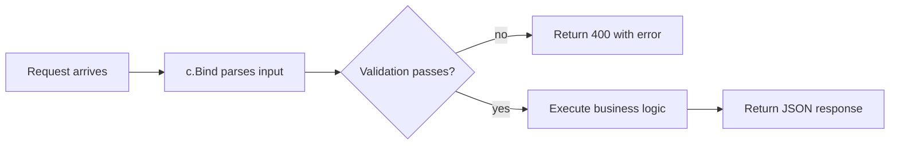

Request parsing is one of the easiest places to create hidden technical debt.

At the beginning of a project, mixed parsing styles seem harmless. A quick `c.Query()` here, a manual `json.Unmarshal(c.Body(), &req)` there, a `c.Params()` somewhere else. After enough endpoints, input behavior becomes unpredictable. One handler parses the body with a JSON decoder, another uses form tags, a third reads query parameters with individual calls. When bugs appear, you have to trace parsing logic per endpoint instead of trusting a shared convention.

Fiber v3 binding exists to make that convention explicit. `c.Bind()` is not just a new method name. It is a structured API that supports every input source, has defined precedence rules, integrates validation, and supports custom decoders. If your team agrees on binding, input handling stops being a source of surprises.

<!-- truncate -->

## What v2 Parsing Looked Like

In v2, request data parsing used individual methods on the context:

```go
// v2: scattered parsing methods
func handler(c *fiber.Ctx) error {
    name := c.Query("name")
    id, _ := c.ParamsInt("id")

    var body RequestBody
    if err := c.BodyParser(&body); err != nil {
        return err
    }

    role := c.Get("X-Role")
    session := c.Cookies("session_id")
    // ...
}
```

Each source had its own method, its own error behavior, and its own conventions. Teams that worked across many endpoints often ended up with inconsistent parsing: some handlers used `BodyParser`, others called `json.Unmarshal` directly, and a few mixed query and body parsing without clear precedence.

v3 replaces these with a unified binding API where you declare the source explicitly and the framework handles parsing, type conversion, and validation.

## Focused Source Binding

The most readable pattern is binding from a single, specific source:

```go
type ListUsersQuery struct {
    Page  int    `query:"page"`
    Limit int    `query:"limit"`
    Sort  string `query:"sort"`
}

app.Get("/users", func(c fiber.Ctx) error {
    q := new(ListUsersQuery)
    if err := c.Bind().Query(q); err != nil {
        return c.Status(fiber.StatusBadRequest).JSON(fiber.Map{"error": err.Error()})
    }

    return c.JSON(fiber.Map{"query": q})
})
```

This pattern makes intent obvious: this endpoint only cares about query input. The struct tags document the source, and the `Bind().Query()` call makes parsing explicit in the handler.

The same pattern works for every source:

- `c.Bind().Body(out)` — JSON, XML, form, multipart, MsgPack, CBOR (content-type auto-detected)
- `c.Bind().Query(out)` — URL query parameters
- `c.Bind().Header(out)` — request headers
- `c.Bind().Cookie(out)` — cookies
- `c.Bind().URI(out)` — URL path parameters

## Multi-Source Binding with `Bind().All()`

When an endpoint needs data from multiple sources, `All()` binds from every source with a defined precedence:

```go
type UserInput struct {
    ID    int    `uri:"id" json:"id" query:"id"`
    Name  string `json:"name" form:"name" query:"name"`
    Role  string `header:"X-Role"`
    Token string `cookie:"session_token"`
}

app.Post("/users/:id", func(c fiber.Ctx) error {
    in := new(UserInput)
    if err := c.Bind().All(in); err != nil {
        return c.Status(fiber.StatusBadRequest).JSON(fiber.Map{"error": err.Error()})
    }

    return c.JSON(in)
})
```

The precedence order is fixed by the framework:

1. URI parameters
2. Request body
3. Query parameters
4. Headers
5. Cookies

That means if the same field name appears in both the URI and the query string, the URI value wins. This is a framework contract, not something you have to remember or document per handler. It removes a class of ambiguity bugs in mixed-source endpoints.

## Built-in Validation

Binding integrates with struct validation. You configure a validator once at app level, then every binding call runs validation automatically:

```go
import "github.com/go-playground/validator/v10"

type structValidator struct {
    validate *validator.Validate
}

func (v *structValidator) Validate(out any) error {
    return v.validate.Struct(out)
}

app := fiber.New(fiber.Config{
    StructValidator: &structValidator{validate: validator.New()},
})
```

Now your input structs can use `validate` tags:

```go
type CreateUser struct {
    Name  string `json:"name" validate:"required"`
    Email string `json:"email" validate:"required,email"`
    Age   int    `json:"age" validate:"gte=18,lte=120"`
}

app.Post("/users", func(c fiber.Ctx) error {
    u := new(CreateUser)
    if err := c.Bind().Body(u); err != nil {
        // includes both parse errors and validation errors
        return c.Status(fiber.StatusBadRequest).JSON(fiber.Map{"error": err.Error()})
    }

    return c.JSON(u)
})
```

The validation runs after parsing, so a single `Bind().Body()` call handles both deserialization and validation. No separate validation step, no risk of forgetting to validate in one handler.

## Default Values

Binding supports default values via the `default` struct tag. This is useful for pagination and optional filters:

```go
type SearchQuery struct {
    Page     int      `query:"page,default:1"`
    Limit    int      `query:"limit,default:20"`
    Tags     []string `query:"tags,default:latest|featured"`
}

app.Get("/search", func(c fiber.Ctx) error {
    q := new(SearchQuery)
    if err := c.Bind().Query(q); err != nil {
        return c.Status(fiber.StatusBadRequest).JSON(fiber.Map{"error": err.Error()})
    }

    // q.Page is 1 if not provided, q.Tags is ["latest", "featured"]
    return c.JSON(q)
})
```

Defaults are applied before validation, so a field with a default value will pass `required` validation even if the client did not send it. Slice defaults use `|` as separator.

## Custom Binders for Non-Standard Formats

If your API accepts formats beyond JSON, XML, and form data, you can register custom binders. A YAML binder, for example:

```go
type yamlBinder struct{}

func (y *yamlBinder) Name() string          { return "yaml" }
func (y *yamlBinder) MIMETypes() []string   { return []string{"application/yaml"} }
func (y *yamlBinder) Parse(c fiber.Ctx, out any) error {
    return yaml.Unmarshal(c.Body(), out)
}

app.RegisterCustomBinder(&yamlBinder{})
```

Once registered, `Bind().Body()` auto-detects `application/yaml` content and uses your binder. You can also call it explicitly with `Bind().Custom("yaml", &out)`.

## CBOR and MsgPack Support

Fiber v3 natively supports [CBOR](https://cbor.io/) and [MsgPack](https://msgpack.org/) in addition to JSON, XML, and form data. These binary formats are more compact and faster to parse, which makes them practical for high-throughput internal APIs:

```go
type Event struct {
    Type string `json:"type" msgpack:"type" cbor:"type"`
    Data []byte `json:"data" msgpack:"data" cbor:"data"`
}

app.Post("/events", func(c fiber.Ctx) error {
    e := new(Event)
    if err := c.Bind().Body(e); err != nil {
        return c.Status(fiber.StatusBadRequest).JSON(fiber.Map{"error": err.Error()})
    }

    return c.JSON(e)
})
```

The correct binder is selected automatically based on the `Content-Type` header. No handler changes are needed to support multiple formats.

## A Handler Shape That Scales

A stable pattern across all endpoints is: bind input, validate, execute logic, map response.



When every endpoint follows this shape, onboarding gets easier and reviews become faster because the structure is predictable. If someone adds a handler that skips binding or validates differently, it stands out immediately.

## Where to Start

Start with endpoints that currently parse from multiple sources (path + body + header). They get the biggest reliability gain from moving to explicit binding. Then add a struct validator to catch input errors before they reach business logic.

## Internal References

- [Bind API](/api/bind)
- [Ctx API](/api/ctx)
- [What's New](/whats_new)
