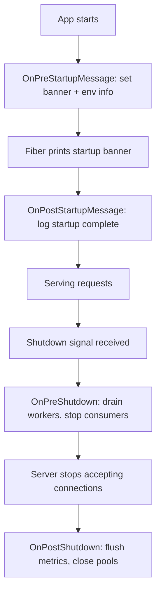

Many runtime incidents happen during transitions, not steady state.

A service is starting up, shutting down, draining workers, or flushing telemetry, and behavior is only partially defined. If your deploy process relies on conventions like "we always flush metrics before exit," but nobody enforced that in code, you get data loss during rollouts. If startup checks happen in scattered goroutines, a failing dependency might not block listen, and you serve errors for the first few seconds after deploy.

Fiber v3 hooks give that lifecycle a concrete structure. Instead of hoping everyone follows the same script, you can register pre and post handlers for startup and shutdown and make the behavior reviewable.

<!-- truncate -->

## What v2 Lifecycle Looked Like

In v2, the main lifecycle hook was `OnShutdown`. It ran during server shutdown, but you had no way to distinguish "before the server stops accepting" from "after everything is drained." Teams often worked around this with manual signal handling:

```go
// v2-era pattern: manual signal handling outside Fiber
quit := make(chan os.Signal, 1)
signal.Notify(quit, syscall.SIGINT, syscall.SIGTERM)

go func() {
    <-quit
    log.Println("stopping workers...") // hope this runs before Shutdown
    stopConsumers()
    app.Shutdown()
}()

app.Listen(":3000")
```

The problem was ordering. You could not guarantee that worker drain happened before or after the server stopped, and the shutdown error was invisible unless you wired it yourself.

v3 replaces `OnShutdown` with explicit `OnPreShutdown` and `OnPostShutdown` hooks, and adds startup message hooks that give you a real contract for each phase.

## Startup Message Customization

One of the most practical additions is the ability to customize the startup banner. In production, the default Fiber banner is noise. In staging, you want environment context visible immediately when a pod starts.

```go
app := fiber.New()

app.Hooks().OnPreStartupMessage(func(sm *fiber.PreStartupMessageData) error {
    sm.BannerHeader = "MY-SERVICE " + sm.Version + "\n-------"

    sm.AddInfo("region", "Region", os.Getenv("AWS_REGION"))
    sm.AddInfo("release", "Release", os.Getenv("RELEASE_SHA"))
    sm.AddWarning("debug", "Debug mode", "enabled")
    return nil
})

app.Hooks().OnPostStartupMessage(func(sm *fiber.PostStartupMessageData) error {
    if !sm.Disabled && !sm.IsChild && !sm.Prevented {
        log.Println("startup banner printed, service ready")
    }
    return nil
})
```

Inside `OnPreStartupMessage` you have full control:

- `sm.BannerHeader` replaces the ASCII art banner
- `sm.AddInfo`, `sm.AddWarning`, `sm.AddError` add labeled entries
- `sm.ResetEntries()` clears all default entries if you want a clean slate
- `sm.PreventDefault = true` suppresses the banner entirely without affecting other hooks

The `PostStartupMessageData` gives you flags to check whether the banner was actually printed (`Disabled`, `IsChild`, `Prevented`), so you can gate post-startup logic accordingly.

## Shutdown Hooks with Clear Phases

The shutdown hooks split a single event into two phases with different responsibilities:

```go
app.Hooks().OnPreShutdown(func() error {
    log.Println("pre-shutdown: stop accepting new work")
    return stopConsumers()
})

app.Hooks().OnPostShutdown(func(err error) error {
    if err != nil {
        log.Printf("shutdown had errors: %v", err)
        alertOps(err)
    }
    return flushMetrics()
})
```

`OnPreShutdown` runs before the server finishes shutting down. This is where you stop queue consumers, cancel background workers, and drain in-flight requests.

`OnPostShutdown` runs after the server is down and receives the shutdown error. This is where you flush metrics, close database pools, and send final telemetry. The error parameter tells you whether shutdown was clean or not, so you can adjust your cleanup accordingly.

Important: when using shutdown hooks, `app.Listen()` must run in a goroutine so `app.Shutdown()` is reachable:

```go
go app.Listen(":3000")
// ... signal handling ...
app.Shutdown()
```

## Route and Group Registration Hooks

Beyond lifecycle, Fiber v3 also provides hooks that fire during route registration. These are useful for building route registries, auto-generating documentation, or enforcing naming conventions at startup time.

```go
app.Hooks().OnRoute(func(r fiber.Route) error {
    log.Printf("registered: %s %s", r.Method, r.Path)
    return nil
})

app.Hooks().OnGroup(func(g fiber.Group) error {
    log.Printf("group registered: %s", g.Prefix)
    return nil
})
```

`OnName` fires when a route is named, which is useful if your team enforces named routes for link generation:

```go
app.Hooks().OnName(func(r fiber.Route) error {
    if r.Name == "" {
        return fmt.Errorf("route %s %s must have a name", r.Method, r.Path)
    }
    return nil
})

app.Get("/users", listUsers).Name("listUsers")
```

## Mount Hooks for Sub-Applications

When you compose applications from sub-apps, `OnMount` fires after a child app is mounted. The callback receives the parent app, so you can inspect or modify the parent during composition:

```go
api := fiber.New()
api.Hooks().OnMount(func(parent *fiber.App) error {
    log.Printf("api mounted at: %s", parent.MountPath())
    return nil
})

app.Use("/api", api)
```

This is useful for plugin-style architectures where sub-apps need to register shared middleware or verify parent configuration before they start serving.

## Putting It Together: A Production Lifecycle

Here is what a realistic lifecycle setup looks like when you combine several hooks:



The key insight is that each phase has a clear owner. You can review lifecycle behavior in a pull request the same way you review business logic, because it lives in code with explicit ordering.

## Where to Start

If your service currently has no lifecycle hooks, start with two:

1. `OnPreShutdown` to drain background work before exit
2. `OnPostShutdown` to flush telemetry and confirm clean shutdown

That alone eliminates the most common class of deploy-related data loss. Once that works, add startup message customization so your team can see environment context in logs without grepping for it.

## Internal References

- [Hooks API](/api/hooks)
- [What's New](/whats_new)
