# Internal Architecture

## Overall Architecture

At the heart of Fiber is the **App** struct. It is responsible for configuring the server, managing a pool of Contexts (either our default implementation, **DefaultCtx**, or a user‑supplied **CustomCtx**), and holding the router stack with all registered routes and groups. In addition, the App contains mount fields to support sub‑applications and hooks that allow developers to run custom code at key stages (e.g. when registering routes or starting the server).

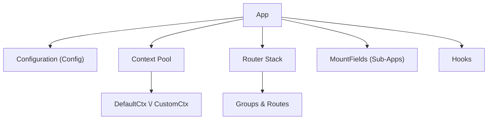

### Explanation

- App: The central object that bootstraps and runs the Fiber server.
- Configuration (Config): Contains settings for body limits, timeouts, TLS options, routing behavior (e.g. case‑sensitivity, strict routing), and more.
- Context Pool: A synchronized pool from which Contexts are acquired per request. This design minimizes allocations by recycling DefaultCtx (or CustomCtx) instances.
- Router Stack: Organizes all registered routes. It is later processed into a tree structure for fast route‑matching.
- MountFields: Support for mounting sub‑applications so that large APIs can be segmented into independent routers.
- Hooks: Allow for custom behavior at critical points (e.g., on route registration, route naming, on listen, on shutdown, etc.).

## Request Handling Flow

When an HTTP request is received by Fiber’s fasthttp server, the following steps occur:
1. Request Arrival: The fasthttp server receives the HTTP request.
2. Context Acquisition: The App calls AcquireCtx() to fetch a Context from the pool.
3. Request Handler: Depending on the configuration, either the default or custom request handler is used.
4. Route Matching: The next() or nextCustom() methods traverse the router tree (built from the router stack) to find a route whose pattern and HTTP method match the incoming request.
5. Handler Chain Execution: The matched route’s handler chain is executed sequentially.
6. Response Generation: Once all middleware and route handlers have been processed, a response is sent back to the client.

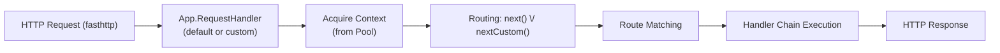

### Explanation

- The incoming request is first handled by Fiber’s request handler (either the default or a custom one).
- A Context is acquired from the pool to encapsulate request and response data.
- The router matching logic then searches for a route that fits the request’s URL and method.
- The associated handler chain is invoked, and after processing, the response is returned to the client.

## Routing & Path Parsing

Fiber allows you to register routes using helper methods (e.g. Get(), Post()) or by creating groups and sub‑routers. Internally, the route pattern is parsed by the parseRoute() function. This function decomposes the route string into segments:
- Constant Segments: Fixed parts of the path (e.g. /api).
- Parameter Segments: Dynamic parts that begin with a colon. For example, a route may be defined as:
/api/\:userId&lt;int&gt;
Here, the segment \:userId&lt;int&gt; is a parameter segment with a type constraint (an integer).
- Constraints: Constraints (such as int, bool, datetime, or even regular expressions) are extracted from the parameter part and stored in the route’s metadata for validation at runtime.

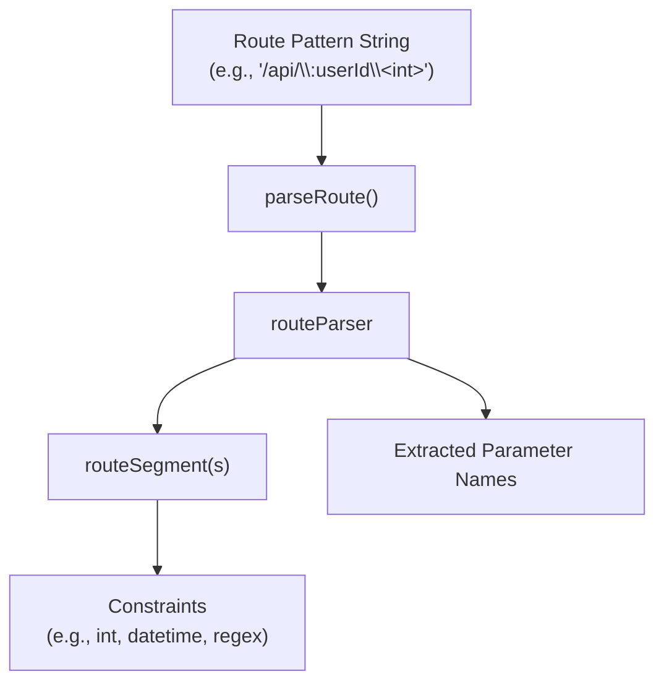

### Explanation

- parseRoute(): Takes a route string and returns a routeParser struct that includes a list of routeSegment objects.
- routeSegment: Represents a portion of the route. If it is a parameter segment, it may include constraints that determine the allowed format (for example, ensuring that a parameter is an integer).
- Extracted Parameter Names: These are later used to populate the request’s Context with the actual values parsed from the URL.

## Preforking Mechanism

To take full advantage of multi‑core systems, Fiber offers a prefork mode. In this mode, the master process spawns several child processes that listen on the same port using OS features such as SO_REUSEPORT (or a fallback to SO_REUSEADDR).

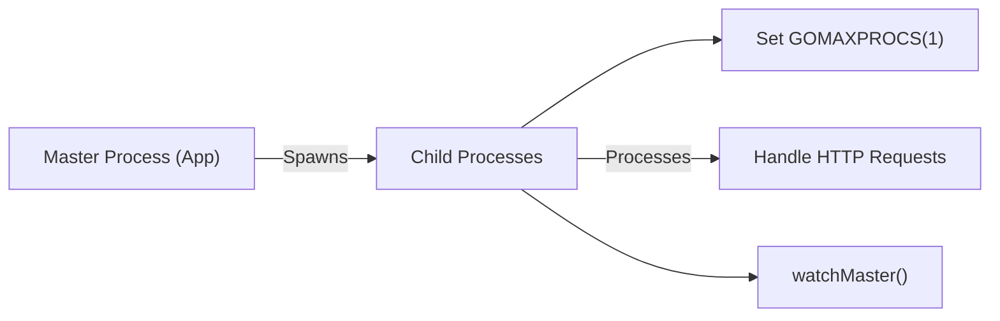

### Explanation

- Master Process: The main process determines the number of available CPU cores and spawns that many child processes.
- Child Processes: Each child sets GOMAXPROCS(1) to run on a single CPU core and listens on the shared port.
- watchMaster(): Each child process runs a watchdog routine to monitor the master process; if the master exits (or its parent process ID becomes 1 on Unix‑like systems), the child terminates gracefully.

### Detailed Preforking Workflow

Fiber’s prefork mode uses OS‑level mechanisms to allow multiple processes to listen on the same port. Here’s a more detailed look:
1. Master Process Spawning: The master process detects the number of CPU cores and spawns that many child processes.
2. Child Process Initialization: Each child process sets GOMAXPROCS(1) so that it runs on a single core.
3. Binding to Port: Child processes use packages like reuseport to bind to the same address and port.
4. Parent Monitoring: Each child runs a watchdog function (watchMaster()) to monitor the master process; if the master terminates, children exit.
5. Request Handling: Each child independently handles incoming HTTP requests.

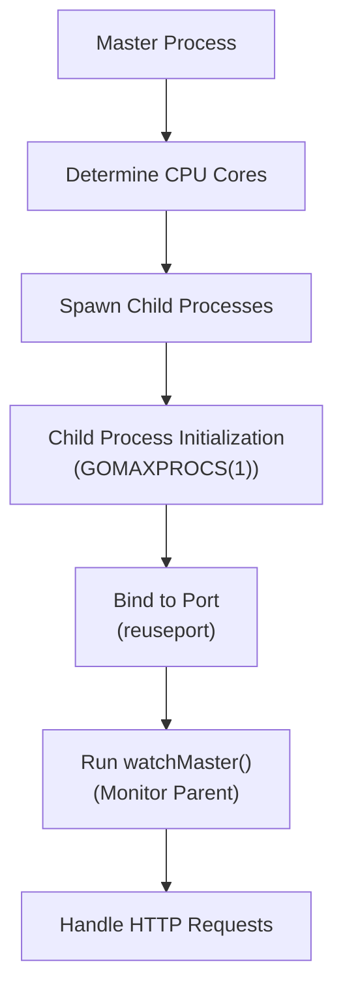

#### Explanation

- Preforking improves performance by allowing multiple processes to handle requests concurrently.
- Using reuseport (or a fallback) ensures that all child processes can listen on the same port without conflicts.
- The watchdog routine in each child ensures that they exit if the master process is no longer running, maintaining process integrity.

## Redirection & Flash Messages

Fiber’s redirection mechanism is implemented via the Redirect struct. This structure allows not only setting a new location for redirection but also passing along flash messages and old input data via a special cookie.

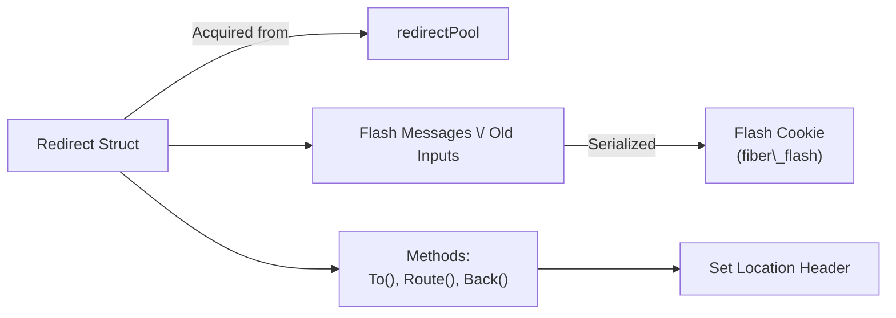

### Explanation
- Redirect Struct: Retrieved from a pool (to minimize allocations), it stores redirection settings such as the HTTP status code (defaulting to 302) and any flash messages.
- Flash Messages & Old Inputs: These are collected via methods like With() or WithInput() and then serialized and stored in a cookie named fiber_flash.
- Redirection Methods: The To(), Route(), and Back() methods determine the target URL and set the Location header accordingly.

### Flash Message Handling in Redirection

When performing redirections, Fiber can send flash messages or preserve old input data. This process involves:
1. Collecting Flash Data: When a redirect is initiated, developers can add flash messages via Redirect.With() or old input data via Redirect.WithInput().
2. Serialization: The flash messages and input data are serialized (using a fast marshalling method) into a byte sequence.
3. Setting a Cookie: The serialized data is stored in a special cookie (named fiber_flash) that will be sent to the client.
4. Retrieval & Clearing: On the subsequent request, the flash data is read from the cookie, deserialized, and then cleared.

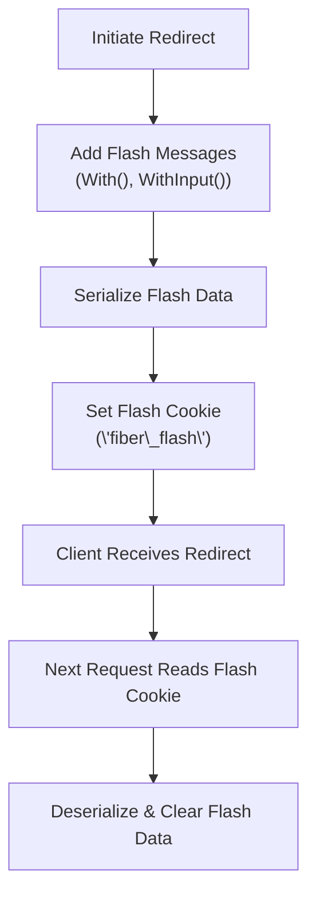

#### Explanation

- Flash messages provide a way to pass transient data (such as notifications or error messages) to the next request after a redirect.
- The data is stored temporarily in a cookie, which is then read and cleared upon processing the next request.
- This mechanism is essential for implementing post‑redirect‑get patterns and ensuring a smooth user experience.

## Hooks, Error Handling & Context Lifecycle

### Hooks

Fiber provides a comprehensive hook system that allows you to run custom functions at key moments:
- OnRoute: Called when a route is registered.
- OnName: Invoked when a route is assigned a name.
- OnGroup: Triggered when a group is created.
- OnListen: Runs when the server starts listening.
- OnShutdown: Called during graceful shutdown.
- OnFork: Invoked when a child process is forked.
- OnMount: Used when a sub‑application is mounted.

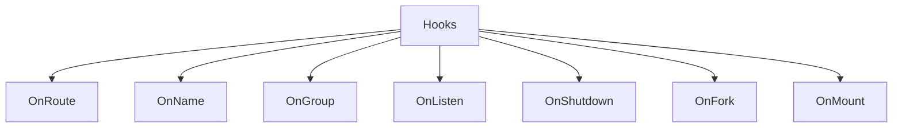

#### Explanation

- Hooks provide extension points for developers and maintainers to inject custom logic without modifying the core Fiber code.
- They are executed at various stages (for example, every time a new route is registered, the OnRoute hooks are executed to allow for logging, validation, or transformation of the route).

### Error Handling & Context Lifecycle

Fiber’s DefaultCtx (or CustomCtx) represents the per‑request context. The lifecycle is as follows:
- Acquire: A Context is obtained from the pool at the beginning of a request.
- Processing: The context is passed along to the route handlers and middleware.
- Error Handling: If an error occurs (e.g., route not found, method not allowed, or a panic in the handler), Fiber calls the registered error handler. Errors such as ErrMethodNotAllowed or StatusNotFound are generated as needed.
- Release: Once the request is processed, the Context is released back into the pool for reuse.

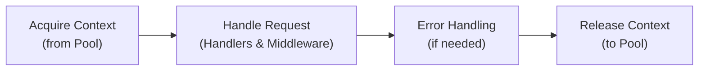

#### Explanation

- This lifecycle ensures that Fiber minimizes allocations by reusing Context objects.
- Errors are propagated and handled consistently, and the context is properly reset after every request.

## Context Lifecycle: Acquisition, Reset, and Release

Fiber minimizes allocations by pooling Context objects. The lifecycle of a Context is as follows:

1. **Acquisition:** When a new HTTP request arrives, a Context is retrieved from the pool via `App.AcquireCtx()`.
2. **Reset:** The acquired Context is reset with the current `fasthttp.RequestCtx` to clear previous data and initialize new request‑specific values.
3. **Processing:** The Context is passed along the middleware and handler chain.
4. **Release:** After processing the request (or when an error occurs), the Context is released back to the pool via `App.ReleaseCtx()`, making it available for reuse.

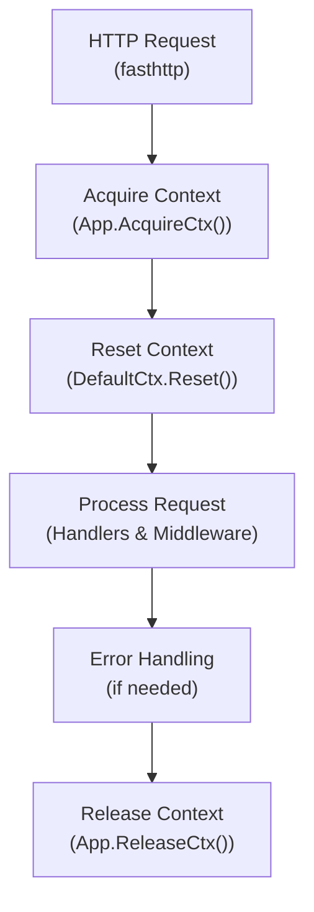

### Explanation

- The Context pooling mechanism helps Fiber reduce garbage collection overhead by reusing Context objects.
- The Reset() method reinitializes the Context with the new request data (such as the URL, method, and headers).
- After the response is sent (or an error occurs), the Context is cleaned up and returned to the pool for the next incoming request.

## Route Matching and Parameter Extraction

When a request is received, Fiber uses its pre‑computed route tree to find a matching route. The route matching process involves:
1. Extracting the “detection path”: A normalized version of the URL (lowercased, trailing slashes trimmed) used for matching.
2. Traversing the Route Tree: Using the method’s tree stack, Fiber checks each route’s pattern.
3. Parameter Extraction: If the route contains parameter segments (e.g. \:userId), the matching algorithm extracts the parameter values and applies any constraints.

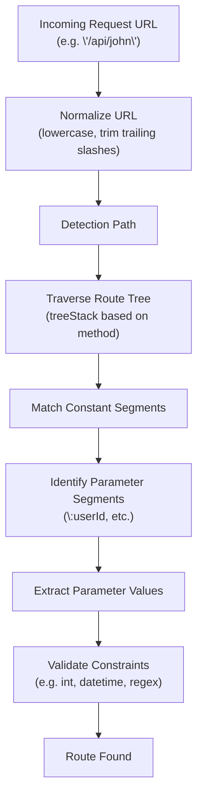

### Explanation

- The normalization process (case conversion and strict routing adjustments) produces a detection path that is compared against registered routes.
- The route tree is organized into groups (by the first few characters of the path) for efficiency.
- During matching, constant segments must exactly match, while parameter segments extract dynamic values that are later validated against any specified constraints.

## Middleware Chain Execution

Once a matching route is found, Fiber executes the chain of middleware and route handlers sequentially. The process is as follows:
1. Initial Handler Execution: The first handler of the matched route is invoked.
2. Calling Next(): Each handler calls Ctx.Next() to pass control to the next handler in the chain.
3. Termination: When no further handlers remain, the chain terminates and the response is sent.

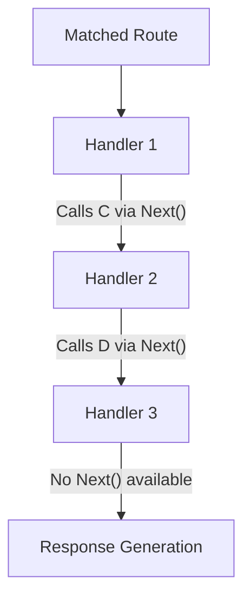

### Explanation

- Each handler in the chain can perform operations (e.g. authentication, logging, transformation) before calling Next() to forward control.
- This sequential processing ensures that middleware are executed in the order they were registered.
- If an error occurs or a handler does not call Next(), the chain may be terminated early, and an error handler may be invoked.

## Sub-Application Mounting & Grouping

Fiber allows mounting sub‑applications (or sub‑routers) under specific path prefixes. This enables modular design of large APIs. The mounting process works as follows:
1. Defining a Mount Point: A parent application calls App.Mount() or a Group calls its own mount() method.
2. Merging Mount Fields: The sub‑app’s mount fields are updated with the prefix of the parent, and its routes are integrated into the parent’s routing structure.
3. Processing Sub‑App Routes: During startup, the parent app collects routes from mounted sub‑apps and builds a unified route tree.

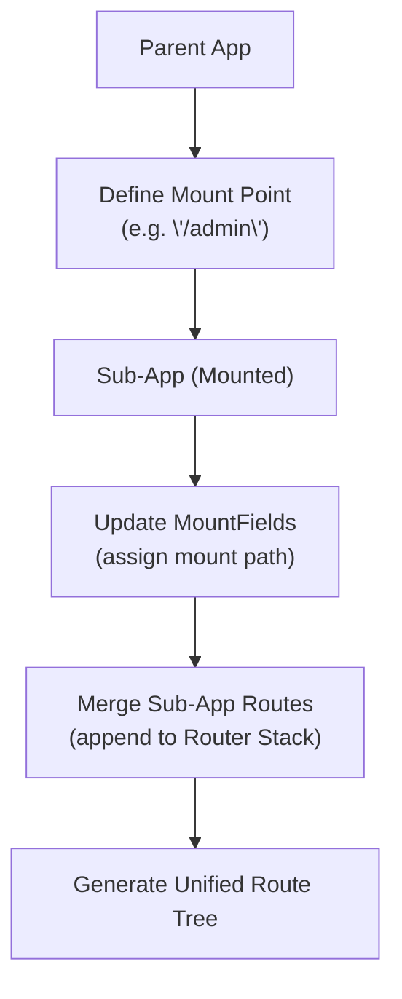

### Explanation

- Mounting allows you to split your API into smaller, manageable parts that are later combined at runtime.
- The mount process involves updating route paths (by prefixing) and merging the sub‑app’s routes into the parent’s route tree.
- This mechanism is transparent to the end‑user, but it is key to achieving modularity in Fiber.

## Route Tree Building

Fiber builds a route tree (the treeStack) to optimize route matching. This involves grouping routes based on a prefix (usually the first few characters) to reduce the number of comparisons during a request.
1. Iterating Over the Router Stack: Each registered route is examined.
2. Computing the Tree Key: A key is computed from the route’s normalized path (e.g. the first 3 characters).
3. Grouping Routes: Routes are added to the appropriate branch of the tree.
4. Sorting: Within each group, routes are sorted based on their registration order (or position) to ensure the correct match is found.

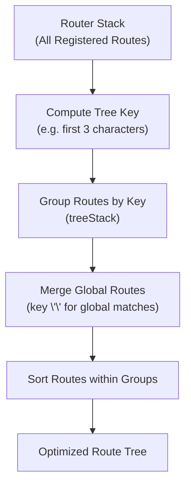

### Explanation

- Building a route tree is an optimization step that reduces the matching overhead by limiting the search space to a subset of routes that share a common prefix.
- The tree is rebuilt whenever new routes are registered, ensuring that the latest routing configuration is always used for matching.

