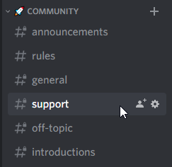

# 🤔 FAQ

## How should I structure my application?

There is no definitive answer to this question. The answer depends on the scale of your application and the team that is involved. To be as flexible as possible, Fiber makes no assumptions in terms of structure.

Routes and other application-specific logic can live in as many files as you wish, in any directory structure you prefer. View the following examples for inspiration:

* [gofiber/boilerplate](https://github.com/gofiber/boilerplate)
* [thomasvvugt/fiber-boilerplate](https://github.com/thomasvvugt/fiber-boilerplate)
* [Youtube - Building a REST API using Gorm and Fiber](https://www.youtube.com/watch?v=Iq2qT0fRhAA)

## How do I handle custom 404 responses?

In Fiber, 404 responses are not the result of an error, so the error handler will not capture them. This behavior is because a 404 response simply indicates the absence of additional work to do; in other words, Fiber has found no routes that match the request.

All you need to do is add a middleware function at the very bottom of the stack \(below all other functions\) to handle a 404 response:


```go
app.Use(func(c *fiber.Ctx) error {
    return c.Status(fiber.StatusNotFound).SendString("Sorry can't find that!")
})
```


## How do I set up an error handler?

To override the default error handler, provide a custom handler to the `app.Errors`


```go
app.Errors(func(c *fiber.Ctx, err error) {
    c.Status(500).SendString(err.Error())
})
```


We have a dedicated page explaining how error handling works in Fiber, see [Error Handling](error-handling.md).

## Which template engines does Fiber support?

Fiber currently supports 8 template engines in our [gofiber/template](https://github.com/gofiber/template) middleware:

* [Ace](https://github.com/yosssi/ace)
* [Amber](https://github.com/eknkc/amber)
* [Django](https://github.com/flosch/pongo2)
* [Handlebars](https://github.com/aymerick/raymond)
* [HTML](https://golang.org/pkg/html/template/)
* [Jet](https://github.com/CloudyKit/jet)
* [Mustache](https://github.com/cbroglie/mustache)
* [Pug](https://github.com/Joker/jade)

To learn more about using Templates in Fiber, see [Templates](faq.md).

## Does Fiber have a community chat?

Yes, we have our own [Discord ](https://gofiber.io/discord)server, where we hang out. We have different rooms for every subject.  
If you have questions or just want to have a chat, feel free to join us via this **&gt;** [**invite link**](https://gofiber.io/discord) **&lt;**.



