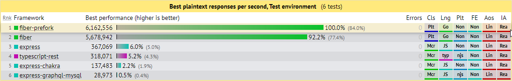

# 📊 Benchmarks

## TechEmpower

🔗 [https://www.techempower.com/benchmarks/](https://www.techempower.com/benchmarks/#section=test&runid=c7152e8f-5b33-4ae7-9e89-630af44bc8de&hw=ph&test=plaintext)

* **CPU** Intel Xeon Gold 5120 @ 2.20GHz
* **MEM** 32GB
* **GO** go1.14 linux/amd64
* **OS** Ubuntu 18.04.3 4.15.0-88-generic
* **NET** Dedicated Cisco 10-gigabit Ethernet switch.

### Plaintext

**Fiber** handled **6,162,556** responses per second with an average latency of **2.0** ms.  
**Express** handled **367,069** responses per second with an average latency of **354.1** ms.

### Data Updates

**Fiber** handled **11,906** responses  per second with an average latency of **42.8** ms.  
**Express** handled **1,474** responses  per second with an average latency of **390.44** ms.

### Multiple Queries

**Fiber** handled **19,865** responses per second with an average latency of **25.7** ms.  
**Express** handled **4,700** responses  per second with an average latency of **117.2** ms.

### Single Query

**Fiber** handled **378,318** responses per second with an average latency of **0.7** ms.  
**Express** handled **59,282** responses  per second with an average latency of **4.4** ms.

### JSON Serialization

**Fiber** handled **1,304,842** responses per second with an average latency of **0.4** ms.  
**Express** handled **245,540** responses  per second with an average latency of **1.1** ms.

## Go web framework benchmark

🔗 [https://github.com/smallnest/go-web-framework-benchmark](https://github.com/smallnest/go-web-framework-benchmark)

* **CPU** Intel\(R\) Xeon\(R\) CPU E5-2630 v4 @ 2.20GHz
* **MEM** 32GB
* **GO** go1.12.7 linux/amd64
* **OS** CentOS Linux release 7.3.1611 (Core)

The first test case mocks **0 ms**, **10 ms**, **100 ms** and **500 ms** processing time in handlers.

The concurrency clients are **5000**.

Latency is the time of real processing time by web servers. _The smaller the better._

Allocs is the heap allocations by web servers when test is running. The unit is MB. _The smaller the better._

If we enable **http pipelining**, test result as below:

Concurrency test in **30 ms** processing time, the test result for **100**, **1000**, **5000** clients is:

If we enable **http pipelining**, test result as below:

Dependency graph for `v1.9.0`

